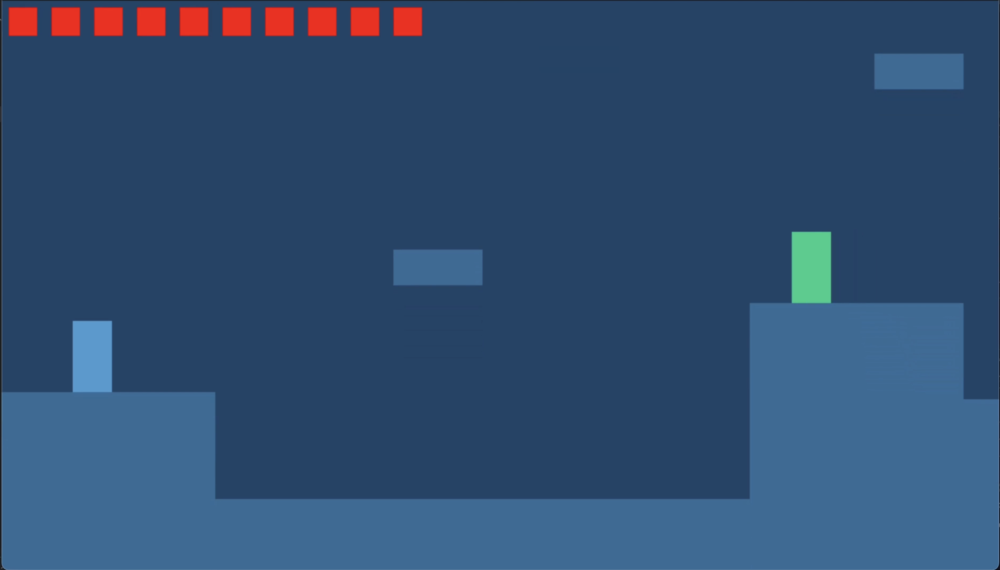
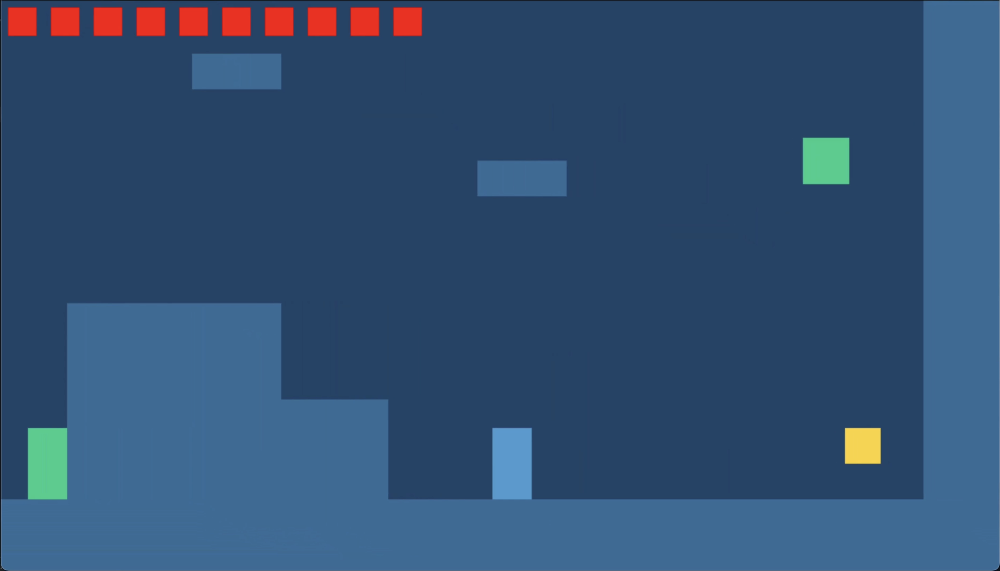
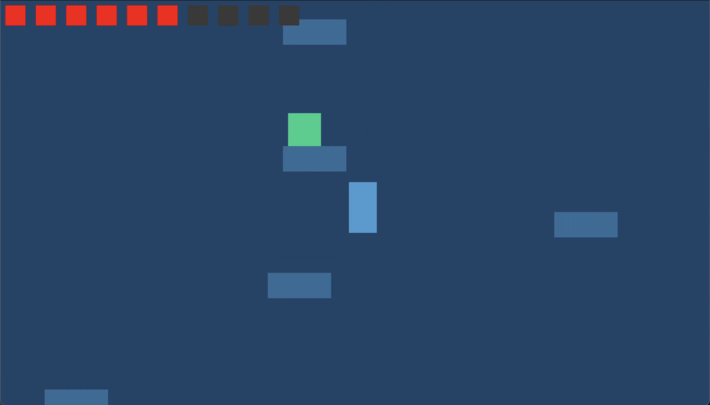
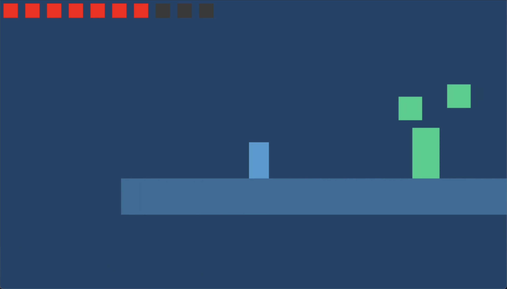

## 2D Platformer/Metroidvania - 30% Coursework for the Comp3016 Immersive Game Technologies Module in C++ SDL, by Jim Toogood  

---

## Assets
All sounds used in this project are copyright-free and licensed for free use. All rights remain with their respective creators as listed below. This project does not claim ownership of any of the third-party assets cited.  

**Sound Assets Used:**  
music.ogg - https://pixabay.com/music/video-games-energetic-chiptune-video-game-music-platformer-8-bit-318348/  
coin.wav - https://pixabay.com/sound-effects/get-coin-351945/  
damage.wav - https://pixabay.com/sound-effects/slap-hurt-pain-sound-effect-262618/  
death.wav - https://pixabay.com/sound-effects/retro-explode-1-236678/ 

---

## How to run game
1) Download repo  
2) Go to folder `Comp3016-30-CW-main/Comp3016_30CW/x64/Debug/`  
3) Ensure following file structure exists there:  
```text
Debug/  
 ├── Comp3016_30CW.exe  
 ├── Comp3016_30CW.pdb  
 ├── SDL2.dll  
 ├── SDL2_mixer.dll  
 ├── Files/  
 │    ├── coin.wav  
 │    ├── coins.json  
 │    ├── damage.wav  
 │    ├── death.wav  
 │    ├── enemies.json  
 │    ├── music.ogg  
 └──  └── platforms.json  
```
4) Open `Comp3016_30CW.exe` and that's it!  

---

## Youtube link
https://youtu.be/ek7UinJIZvc  

---

## Gameplay description
In this game you play as a small blue character, attempting to fight their way through enemies, complete difficult parkour, and ultimately find all the coins to win!  

Controls (keyboard or controller):  
- **Move** left and right with `A` and `D` or `Left Control Stick`  
- **Jump** with `Space` or `Gamepad A`  
- **Dash** with `LShift` or `Right Trigger`  
- **Attack** with `E` or `Gamepad X` (attack direction with `WASD` or `Left Control Stick`)  
- **Collect Coins** by attacking them  

The player has a total of 10 hit points and if the player's health reaches zero they will be sent back to the beginning of the level, and all collected coins will be reset. Collecting coins regenerates health.  

Enemies will follow and attack the player by touching them, so knock them back with your attacks and run away, or keep attacking to kill them (Beware they do respawn)!    

---

## Dependencies used
- **[SDL2](https://github.com/libsdl-org/SDL)** - Core framework  
- **[SDL2_mixer](https://github.com/libsdl-org/SDL_mixer)** - Background music and Sound effects  
- **[nlohmann/json](https://github.com/nlohmann/json)** - For loading player data, enemy data, coins and platform data from JSON files  

All required files and asset folders are included in this repo. No external installations are required to run the executable.  

---

## Use of AI description
ChatGPT (OpenAI GPT-5) was used during development for:  
- Debugging and code assist (for example the AI suggested to use an AABB collision system, which I then implemented) 
- Functional code testing
- Cross-platform setup assistance (VSCode macOS → Visual Studio 2022 Windows migration)  
- Repo and readme report formatting  

---

## Game programming patterns that I used
- **Axis-aligned bounding box (AABB) collision detection** - Collision detection system to check if and where two rectangles (hitboxes) collide with each other  
- **Factory/Loader Pattern** - Enemies, platforms, coins, and player data are loaded dynamically from JSON files  
- **State-based Logic** - Player and enemy behaviour (jump, dash, attack, respawn) is managed through internal state flags  
- **Separation of Concerns & OOP** - Core systems divided into `Game`, `Player`, `Enemy` main classes, and various utility classes, functions and structs  
- **Delta Time & Fixed Timestep Physics** - Frame-independent physics for consistent movement, regardless of performance  
- **Debug Inputs** - Custom inputs that are not usable in the final public build, that assisted development (e.g. player flight, ability to dynamically place platforms, etc.)  
- **Inheritance/Polymorphism** - Enemy abstract base class, which is extended by MeleeEnemy and FlyingEnemy subclasses  
- **Camera** - Camera object (SDL_Rect) that is used during rendering to translate world coordinates into screen coordinates, allowing the game's perspective to smoothly follow the player, whilst retaining a consistent coordinate system  
- **Enemy Object Pooling** - When enemies are killed by the player, they are not destroyed and instead are disabled with bool `isAlive` and then re-enabled once they respawn  

---

## Game mechanics and how they are coded
### Left/Right Movement
When direction is inputed, apply velocity in the relevant direction and change direction player is facing.  
```c++
// Move Left
if (keystate[SDL_SCANCODE_A] || leftStickXAxis < 0.0f) {
    facingLeft = true;
    vel.x = -speed;
}
// Move Right
if (keystate[SDL_SCANCODE_D] || leftStickXAxis > 0.0f) {
    facingLeft = false;
    vel.x = speed;
}
```

### Jump
When jump is pressed, apply jump velocity, and set player isJumping variable to true.  
```c++
// Jump
if (keystate[SDL_SCANCODE_SPACE] || SDL_GameControllerGetButton(controller, SDL_CONTROLLER_BUTTON_A)) {
    if (isGrounded && !isJumping) {
        vel.y = jumpVelocity;
        isJumping = true;
    }
}
else {
    isJumping = false;
}
```

### Attack
When attack pressed and attack is not on cooldown, trigger attack and check for attack direction.  
```c++
// Attack
if (attackPressed && !attackPressedLastFrame && !isAttacking && attackCooldown <= 0.0f) {
    isAttacking = true;
    attackTimer = 0.5f;
    attackCooldown = 0.75f;

    if (keystate[SDL_SCANCODE_W] || leftStickYAxis < 0.0f) {
         // Set attack direction
         attackDirection = AttackDirection::UP;

         // Set attack initial position
         attackHitbox.x = pos.x;
         attackHitbox.y = pos.y - attackHitbox.h;
    }
    else if ((keystate[SDL_SCANCODE_S] || leftStickYAxis > 0.0f) && !isGrounded) {

    //etc.
```

### Combat
If player attack hitbox collides with enemy body, or enemy body collides with player body, take damage.  
```c++
// If player body colliding with enemy body
if (AABB(player.getBody(), body)) {
    player.TakeDamage(1, pos);
}

```

### Enemy Respawn (Object Pooling)
Enemies that die and hidden (returned to pool), then respawn after a set delay.  
```c++
// Apply damage to enemy
health -= damage;

// If hit killed enemy
if (health <= 0) {
    game->PlaySfx("death");
    isAlive = false;
    onScreen = false;
    respawnTimer = 10.0f;
}
else {
    game->PlaySfx("damage");
}
```

### Coin collection
If player attack hitbox collides with a coin that hasn't already been collected, then collect the coin.  
```c++
for (auto& coin : coins) {
    // Only check coins that haven't been collected
    if (coin.collected) { continue; }

    if (AABB(coin.body, attackHitbox)) {
        coin.collected = true;
        game->PlaySfx("coin");

        // Coins heal player
        health = 10;
    }
}
```

### Player death
When player's health is zero (or below) fade to black, reset player position and health, reset coins and enemies, fade back in.
```c++
    void Update() {
        // If player is respawning (fading out)
        if (!playerHasReset) {
            fadeAlpha += Constants::FADE_SPEED * deltaTime;

            if (fadeAlpha >= 255.0f) {
                fadeAlpha = 255.0f;

                // Reset objects whilst screen is covered
                player.RespawnPlayer(camera, 100, 250, 10);
                playerHasReset = true;

                // Respawn enemies and reset coins
                for (auto& enemy : enemies) {
                    enemy->Respawn();
                }
                for (auto& coin : coins) {
                    coin.collected = false;
                }
            }
        }
        // If player is respawning (fading back in)
        else {
            fadeAlpha -= Constants::FADE_SPEED * deltaTime;

            if (fadeAlpha <= 0.0f) {
                fadeAlpha = 0.0f;
                playerIsRespawning = false;
                Mix_FadeInMusic(backgroundMusic, -1, 250);
            }
        }
    }

    void TriggerPlayerDeath() {
        playerIsRespawning = true;
        playerHasReset = false;
        fadeAlpha = 0.0f;
        Mix_FadeOutMusic(750);
    }
```

---

## Sample screens
  
  
  
  

---

## Exception handling and test cases
The code automatically handles several potential runtime errors and edge cases to ensure it doesn't crash under unexpected conditions.  

- **SDL Initialisation Errors**  
SDL subsystems (video, audio, mixer) are each checked immediately after initialisation. If any system fails to initialise, the program outputs the specific SDL error message with `cerr` and stops before trying to use any uninitialised components.  

- **Clamping**  
Clamping is used on several variables to ensure consistency. For example, deltaTime is clamped to 0.05 to ensure clipping doesn't occur at very low FPS (most commonly occurs when the user tabs out of the game whilst it is running).  

- **File Loading Safety**  
When loading (and saving) JSON files, checks are made before any data handling to ensure the file and file path exist and are valid. If they are not an error is outputted and either the program stops, or fallback values are used.  

- **User Testing**  
Brief user testing was carried out to ensure the program was tested on multiple machines, and gameplay worked as intended. This led to several bugs being found and fixed, as well as some gameplay rebalances (for example changing coins to heal the player on collection).  

**Test cases were carried out throughout development, ensuring systems worked as intended as they were structurally implemented, for example:**  
- Attempting to load the game with some assets missing  
- Artificially lowering my computers performance to lag the game to ensure deltaTime system worked as intended  
- Pressing every available keyboard and/or controller input available at once  
- Testing each major mechanic as it was implemented (physics system, combat system, coin collection to win, etc.)  

---

## Evaluation
Overall, I believe this project meets the objectives and expectations of the coursework well, creating a functional, fun and interesting 2D platformer/metroidvania game in C++ and SDL2. It exceeds the functionality and complexity of the minimum expectation of a text-based console game. With thought-out level design, interactive game play elements, a satisfying player experience and good sound design, I am satisfied with how this project turned out.  
  
As far as potential improvements to the project are concerned, my main one is I would have liked to have proper textures and sprites for the player, enemies and environment, as opposed to the coloured rectangles the game currently uses. This was part of my original idea for the project, but I ultimately decided to cut it to give me time to focus on the more impactful and technically challenging aspects of the game.  
